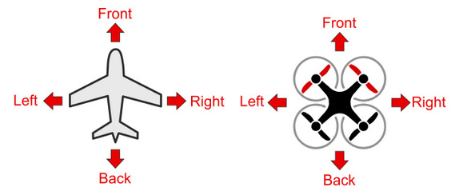

基本飞行概念
==============
|          PixHawk是著名飞控厂商3DR推出的新一代独立、开源、高效的飞行控制器，前身为APM飞
|       控，不仅提供了丰富的外设模块和可靠的飞行体验，有能力的爱好者还可在其基础上进行二次开发。第一次使用需要多方查阅资料，摸索前行，根据本人学习和使用过程整理成文，其中大部分内容来自官网和相关网站的资料，希望对想尝试PixHawk的朋友有所帮助。
|       参考：https://docs.px4.io/master/zh/

1.1    机头指向和方向
-----------------------------
以固定翼与四轴飞行器为例，下图是无人机的载体坐标系:

    -  载体重心为坐标原点

    -  载体前进方向为x轴正方向

    -  载体水平姿态时垂直向下为z轴正向

    -  载体飞行方向指向右为y轴正向（x,y和z轴满足右手螺旋准则）

飞行方向示意图（俯视）：

1.2 遥控与基本飞行控制
----------------------------------------------------------
使用左右油门时，油门最低位置如下图：

1.3多轴飞行器的飞行姿态角
----------------------------------------------------------

-  Roll: 横滚角，以飞行前进方向为轴的左右角度变化

-  Pitch: 倾斜角，以飞行前进方向为轴的高低角度变化（抬头、低头）

-  Yaw: 航向角，飞行器机头指向角度的改变
