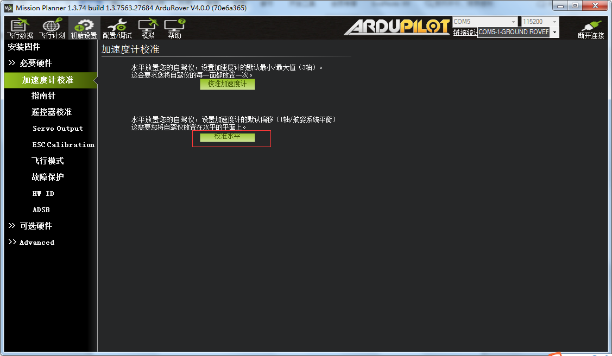
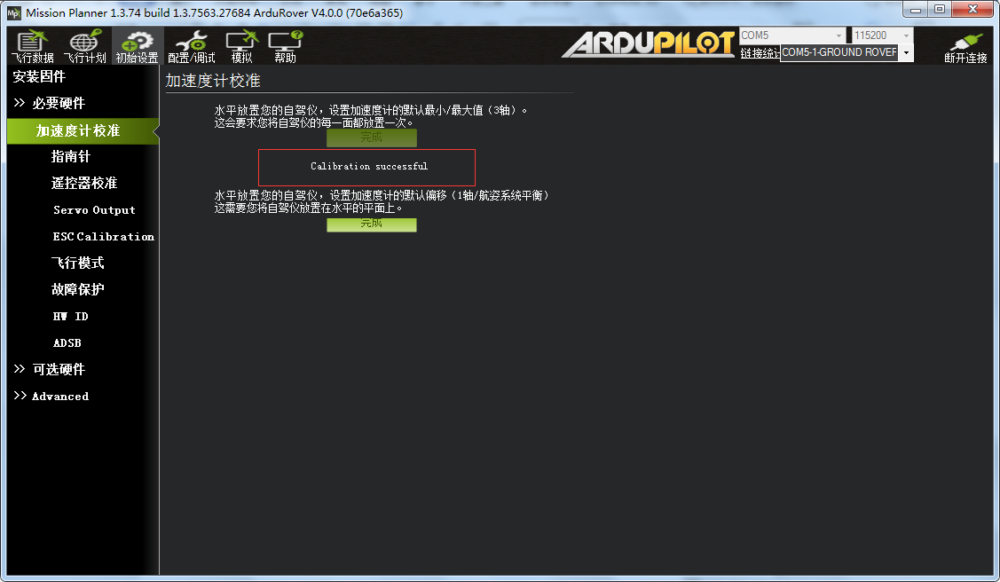
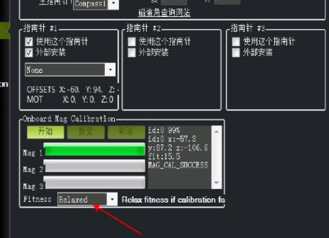
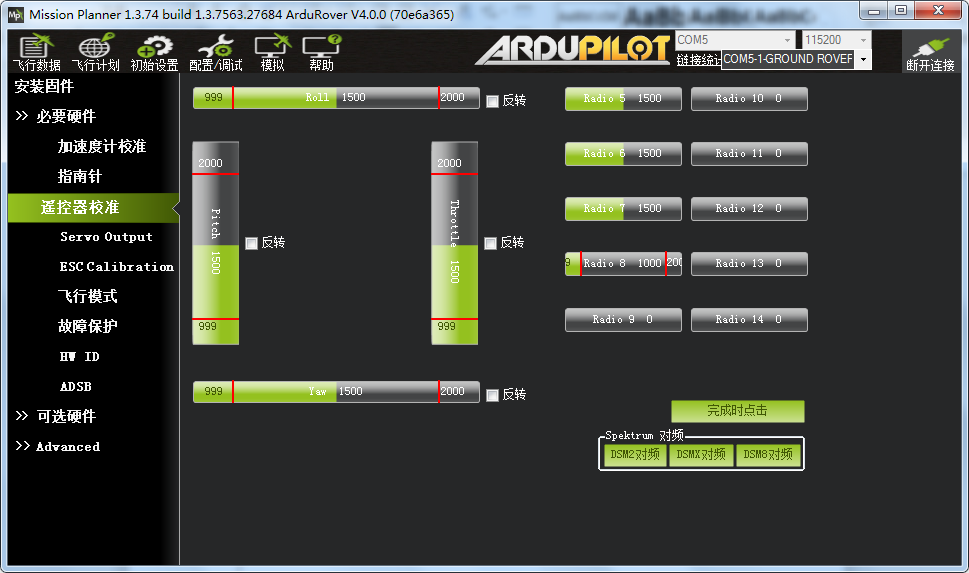
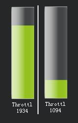
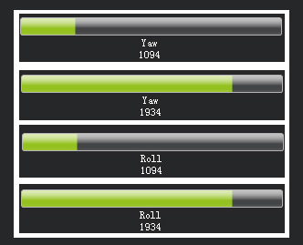
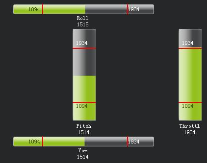
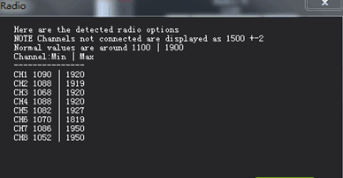

校准
==============

|          当一个全新的固件下载进APM板以后，你首先需要做的是三件事：一是遥控输入校准，二是加
|       速度校准，三是罗盘校准，如果这三件事不做，后续的解锁是不能进行的，MP的姿态界面上也会不断弹出红色提示：PreArm： RC not calibrated（解锁准备：遥控器没有校准）。

|          将GPS的输出接上飞控的对应的GPS MODULE口，打开地面站，USB连接飞控，选择“连接”，连
|       接成功后进入“初始设置”页面，展开左侧“必要硬件”，准备校准。

.. attention:: 设置COM端口号和波特率，选择计算机新增的端口号，波特率选择115200

加速度计校准
-----------------------------
|          点击左侧列表“加速度计校准”进入校准界面，按提示放置飞控，首先校准水平，每一步完成后
|       点击绿色“Click When Done”按钮，如果安装最新地面站后界面为中文，按提示完成校准操作即可。

随后校准加速度计，提示如下：

    第一个：Place vehicle level and press any key: （请把APM水平放置然后按任意键继续）

    第二个：Place vehicle on its LEFT side and press any key: （请把APM左边向上垂直立起）

    第三个：Place vehicle on its RIGHT side and press any key:（请把APM右边向上垂直立起）

    第四个：Place vehicle nose DOWN and press any key: （请把APM机头向下垂直立起）

    第五个：Place vehicle nose UP and press any key: （请把APM机头向上垂直立起）

    第六个：Place APM on its BACK and press any key（请把APM背部向上水平放置）

如图校准成功后提示success：

指南针校准
-----------------------------
|          首先将GPS天线与飞控固定好，确保二者正表面上箭头方向的向指向一致，注意一定要固定好，
|       在后续的旋转过程中二者不能发生偏移，如图所示：

.. image:: ../../images/baseconfig_for_apm/7.jpg
    :height: 1350px
    :width: 1200px
    :scale: 30 %
    :alt: None
    :align: center

**校准步骤如下：**

    1.连接飞控

    2.初始设置-必要硬件-罗盘

    3.只勾选第一个，（如需提高精度也可添加外置罗盘）准备好后点击开始现场校准

    .. image:: ../../images/baseconfig_for_apm/04.png

    4.进行校准

    方法：每个面绕其中心轴旋转360度，校准过程中注意千万不要碰到USB线，以免断开飞控。

    5.校准完后，界面会有新的三轴的值，绿色值表示正常。

    .. image:: ../../images/baseconfig_for_apm/05.png

    6.注意事项

    （1）在室内会做校正罗盘时候，室内设备会对地磁产生干扰影响罗盘精度，如需提高精度建议在室外做一次。

    （2）APM内置的罗盘很容易受到飞控内电子元件干扰，还有电池、接收机等其它的干扰，如果用外置的罗盘的话精度会增加不少。

    （3）在飞行器重新布线、升级固件、添加或者换设备时候，建议重新做一次校正罗盘。

|          如果你刷了1.3.5以上版本的固件，还加了外置罗盘，可能会遇到一个问题：就是外置罗盘一直
|       没法校准，进度条一直在动，没有提示校准成功。那这个问题在哪里呢?

|          没校准之前，GPS所在的磁场环境可能和飞控内置罗盘磁场有所不同导致存在偏差。导致校准
|       GPS罗盘没有正确触碰到白点，而恰恰最新版的地面站去掉了显示白点的界面，有时候校准存在一些不方便!

.. tip:: 最新版本的固件对罗盘校准要求越来越高。如果你刷了最新版本固件，还用了最新地面站，如果你校准时，飞控和GPS没有固定一起，或者飞控和GPS的箭头不一致，基本上校准不通过。所以，新版本固件校准时，一定要确保飞控和GPS箭头一致，校准移动时，要同步同时移动飞控和GPS，不可以单独。

**解决方法：**  

    1.刷了最新版本固件，要用最新的地面站，否则可能校准过程会卡在99%就不动了。

    2.GPS要固定好，GPS用支架撑起来，飞控的箭头和GPS的箭头保持（这点非常重要，否则基本通不过)。校准时，飞控和GPS一起同步移动（不同步移动，基本校准不过)。
    
    .. hint:: 如果GPS固定好，箭头和飞控箭头一致，安装到机架上，很容易通过校准。箭头一致后，用手固定好GPS和飞控，移动时，GPS和飞控同步同时移动。

    3.地面站的Fitness改为Relaxed 或者default，重新校准罗盘，就很容易校准。

遥控器校准
-----------------------------
|          GPS校准后，断电后按照规范接上FS-1A6B接收机连接飞控 PPM RC端口进行遥控器校准。

.. attention:: 接收机接错，飞控极有烧毁的可能。

**1.遥控器通道配置**

    通道1：roll(横滚)

    通道2：pitch(俯仰)

    通道3：throttle（油门）

    通道4：yaw（偏航）

    通道5：飞行模式（辅助通道，具体可见遥控器辅助通道及失控保护）

    美国手：左手油门（遥控器系统设置中的摇杆模式为2）

    日本手：右手油门

.. image:: ../../images/baseconfig_for_apm/9.png
    :height: 1350px
    :width: 1800px
    :scale: 30 %
    :alt: None
    :align: center

**2.开始遥控器校准（以美国手为例）**

将遥控器通道按钮都拨至最上方，同时按下遥控器两边的开机按钮。

（1）连接地面站（飞控自检完成后）

（2）点击初始设置-可选硬件-遥控器校准

（3）打开遥控器，确认已接上接收机。

（4）来回拨动遥控器的开关，使每个档位分别到达其最大和最小，MP遥控通道上红色线条的显示，让地面站记录其最大行程和最小行程。

.. attention:: 这里要保证油门上推，代表油门的绿色条也向上，roll和Yaw也是，pitch相反，如果不是，可在遥控器的舵机相位中修改正反相

（5）点击完成，会出现各通道值。

（6）观测遥控器行程，最小值小于1100，最大值大于1900，则遥控器正常

.. attention:: 遥控器左右摇杆控制4个柱面（正确的方向在图下文字中做出了说明）只有升降舵为反向。

正向：表示上下左右和摇杆操作一致，例如，向左打杆，输出变小，向上打杆，输出变大
反向：表示上下左右和摇杆操作相反，例如，向左打杆，输出变大，向上打杆，输出变小。

油门推到顶/油门降到底（正向为正确（如果油门推上去输出反而下降，则需要在遥控器设置中将油门反向））

|          左摇杆打到最左/左摇杆打到最右（方向、航向、偏航：机头指向，正向为正确）,右摇杆打到最
|       左侧/右摇杆打到最右侧（副翼-横滚，正向为正确）

右摇杆推到顶/右摇杆打到底（升降：右摇杆上下， 反向为正确）

所有摇杆均在1094-1934之间变化，满足要求。

|          点击“校准”，将遥控器左右摇杆重复打到最值，即左右摇杆在最大值上不停转圈，得到校准数据
|       如下：

|          操作完成后点击“完成时点击”按钮，弹出完成提示对话框点击“OK”后将弹出校准数据，说明指
|       南针校准成功：

