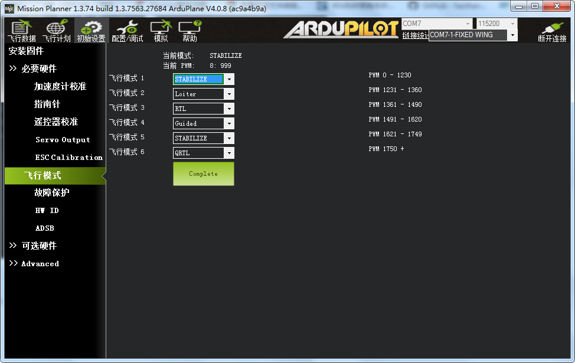

飞行模式设置
==============

⻜⾏模式注解
-----------------------------

1、稳定模式Stabilize稳定模式是使⽤得最多的⻜⾏模式，也是最基本的⻜⾏模式，起⻜和降落 都应该使⽤此模式。此模式下，⻜控会让⻜⾏器保持稳定，是初学者进⾏⼀般⻜⾏的⾸选，也 是FPV第⼀视⻆⻜⾏的最佳模式。⼀定要确保遥控器上的开关能很⽅便⽆误地拨到该模式，应 急时会⾮常重要。

2、⽐率控制模式Acro 这个是⾮稳定模式,这时apm将完全依托遥控器遥控的控制，新⼿慎 ⽤。 

3、定⾼模式ALT_HOLD定⾼模式(Alt Hold)是使⽤⾃动油⻔，试图保持⽬前的⾼度的稳定模 式。定⾼模式时⾼度仍然可以通过提⾼或降低油⻔控制，但中间会有⼀个油⻔死区，油⻔动作 幅度超过这个死区时，⻜⾏器才会响应你的升降动作 当进⼊任何带有⾃动⾼度控制的模式，你⽬前的油⻔将被⽤来作为调整油⻔保持⾼度的基准。 在进⼊⾼度保持前确保你在悬停在⼀个稳定的⾼度。⻜⾏器将随着时间补偿不良的数值。只要 它不会下跌过快，就不会有什么问题。 离开⾼度保持模式时请务必⼩⼼，油⻔位置将成为新的油⻔，如果不是在⻜⾏器的中性悬停位 置，将会导致⻜⾏器迅速下降或上升。 在这种模式下你不能降落及关闭⻢达，因为现在是油⻔摇杆控制⾼度，⽽⾮⻢达。请切换到稳 定模式，才可以降落和关闭⻢达。

4、悬停模式Loiter悬停模式是GPS定点+⽓压定⾼模式。应该在起⻜前先让GPS定点，避免在 空中突然定位发⽣问题。其他⽅⾯跟定⾼模式基本相同，只是在⽔平⽅向上由GPS进⾏定位。 

5、简单模式Simple Mode简单模式相当于⼀个⽆头模式，每个⻜⾏模式的旁边都有⼀个 SimpleMode复选框可以勾选。勾选简单模式后，⻜机将解锁起⻜前的机头指向恒定作为遥控 器前⾏摇杆的指向，这种模式下⽆需担⼼⻜⾏器的姿态，新⼿⾮常有⽤。 

6、⾃动模式 AUTO⾃动模式下，⻜⾏器将按照预先设置的任务规划控制它的⻜⾏ 由于任务规划依赖GPS的定位信息，所以在解锁起⻜前，必须确保GPS已经完成定位（APM板 上蓝⾊LED常亮） 切换到⾃动模式有两种情况： 如果使⽤⾃动模式从地⾯起⻜，⻜⾏器有⼀个安全机制防⽌你误拨到⾃动模式时误启动发⽣危 险，所以需要先⼿动解锁并⼿动推油⻔起⻜。起⻜后⻜⾏器会参考你最近⼀次ALT Hold定⾼ 的油⻔值作为油⻔基准，当爬升到任务规划的第⼀个⽬标⾼度后，开始执⾏任务规划⻜向⽬ 标； 如果是空中切换到⾃动模式，⻜⾏器⾸先会爬升到第⼀⽬标的⾼度然后开始执⾏任务 

7、返航模式RTL返航模式需要GPS定位。GPS在每次解锁前的定位点，就是当前的“家”的 位置；GPS如果在起⻜前没有定位，在空中⾸次定位的那个点，就会成为“家”。 进⼊返航模式后，⻜⾏器会升⾼到15⽶，或者如果已经⾼于15⽶，就保持当前⾼度，然后⻜ 回“家”。 还可以设置⾼级参数选择到“家”后是否⾃主降落，和悬停多少秒之后⾃动降落。 

8、绕圈模式Circle当切⼊绕圈模式时，⻜⾏器会以当前位置为圆⼼绕圈⻜⾏。⽽且此时机头 会不受遥控器⽅向舵的控制，始终指向圆⼼。 如果遥控器给出横滚和俯仰⽅向上的指令，将会移动圆⼼。 与定⾼模式相同，可以通过油⻔来调整⻜⾏器⾼度，但是不能降落。 圆的半径可以通过⾼级参数设置调整。 

9、指导模式Guided需要地⾯站软件和⻜⾏器之间通信。连接后，在任务规划器MissionPlanner软件地图界⾯上，在地图上任意位置点⿏标右键，选弹出菜单中的“Fly tohere”（⻜到这⾥），软件会让你输⼊⼀个⾼度，然后⻜⾏器会⻜到指定位置和⾼度并保 持悬停。 

10、跟随模式FollowMe跟随模式基本原理是：操作者⼿中的笔记本电脑带有GPS，此GPS会 将位置信息通过地⾯站和数传电台随时发给⻜⾏器，⻜⾏器实际执⾏的是“⻜到这⾥”的指 令。其结果就是⻜⾏器跟随操作者移动。

⻜⾏模式设置
-----------------------------

在飞行模式选项栏查看飞行模式设置是否正常：

    - 第6通道摇杆在最上位时，拨动第5通道摇杆对应的飞行模式是第5、2、1。

    - 第6通道摇杆在最中位时，拨动第5通道摇杆对应的飞行模式是第6、4、3。

根据自己的需要选择需要飞行模式后保存即可。