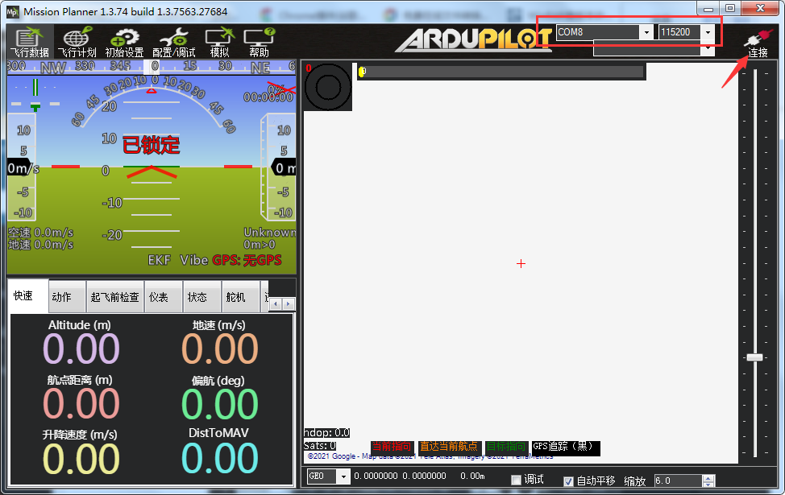
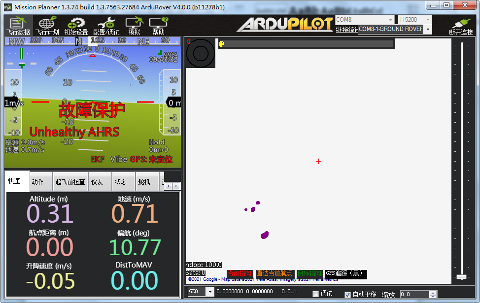

APM基础
==============
APM简介
-----------------------------
历史
>>>>>>>>>>>>>>>
|          ArduPilot的“Ardu”部分取自Arduino。最初APM1自动导航板是基于Arduino开发环境的。到现在
|       就不再使用Arduino运行库了。尽管仍然使用稍加修改的Arduino集成开发环境版本，来支持用于基于AVR的APM1与APM2板的ArduPilot。因为现在不仅支持Arduino兼容硬件（如PX4），为表示当前代码的跨平台特性，把“Ardu”前缀从软件项目取消，改为了“APM” 前缀。

|          由于APM良好的可定制性，通过开源软件Mission Planner，开发者可以配置APM的设置，接受
|       并显示传感器的数据。目前APM飞控已经成为开源飞控成熟的标杆，可支持多旋翼、固定翼、直升机和无人驾驶车等无人设备。针对多旋翼，APM飞控支持各种四、六、八轴产品，并且连接外置GPS传感器以后能够增稳，并完成自主起降、自主航线飞行、回家、定高、定点等丰富的飞行模式。APM能够连接外置的超声波传感器和光流传感器，在室内实现定高和定点飞行。

Mission Planner地面站
>>>>>>>>>>>>>>>>>>>>>>>

    Mission Planner是一款免费开源、比较成熟稳定的地面站，只有Windows版本。

    - `从这里打开Mission Planner官网 <https://ardupilot.org/planner/docs/mission-planner-installation.html>`_

    - 打开官网，找到“MissionPlanner”选项

    .. image:: ../../images/baseconfig_for_apm/00.png
        :alt: None
        :align: center

    - 根据自己需要选择相应的安装包

    .. image:: ../../images/baseconfig_for_apm/01.png

    - 双击下载的.msi文件以运行安装程序

    - 根据个人情况安装路径，默认的情况下是C盘，自定义完成以后再点击“下一步”

    - 当安装程序安装一半时会出现“设备驱动程序安装向导”界面。这里需要安装，点击“设备驱动程序安装向导”界面的“下一步”

    - 当“设备驱动程序安装向导”安装完成以后，检查“设备驱动程序安装向导”界面里的“驱动程序名”是否全部安装正确。然后点击“完成”，此时Mission Planner地面站安装成功。

地面站连接到飞控
-----------------------------

要建立连接，您必须首先选择要使用的通信方法/通道，然后设置物理硬件和Windows设备驱动程序。使用USB线连接飞控的USB口。

.. attention:: Windows上必须存在用于连接硬件的驱动程序，因为这会使您的连接的COM端口和默认数据速率可供Mission Planner使用

在Mission Planner上，使用屏幕右上方的下拉框设置端口和波特率。

.. hint:: 连接USB后，系统会自动为飞控分配一个COM端口号，该端口号将显示在下拉菜单中，还需要设置用于连接的适当的波特率（通常USB连接波特率为115200，无线连接速率为波特率）

设置好端口号和波特率后点击连接，此时说明连接成功

