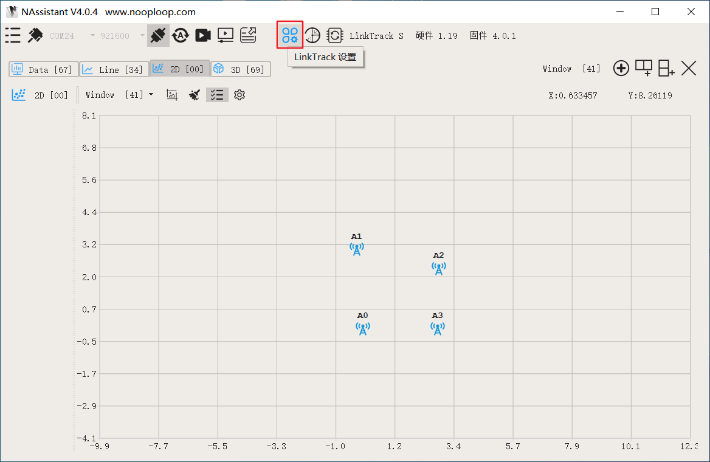
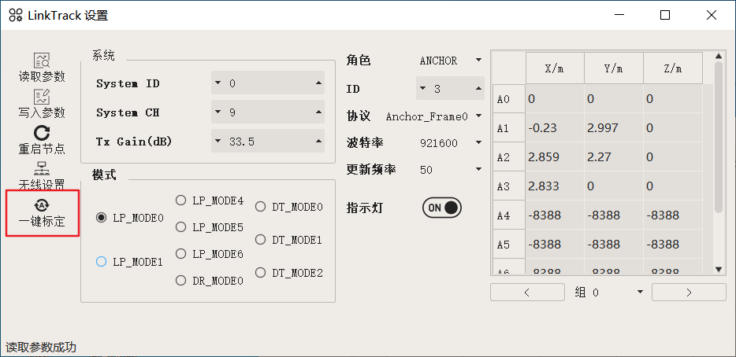

UWB无人机集群
==============
UWB介绍
-----------------------------

|          UWB测距是使用双向飞行时间法(TW-TOF，two way-time of flight )，TOF测距方法属于双向测
|       距技术，它主要利用信号在两个异步收发机(Transceiver)之间往返的飞行时间来测量节点间的距离。节点间的距离能得到，那么我们就可以进行定位了，UWB定位技术的原理和GPS卫星导航定位原理是类似的，都是通过无人机上面的标签与四个基站之间进行测距，再通过算法就可以把无人机的位置数据计算出来。

UWB无人机集群介绍
-----------------------------

|         UWB定位技术可在满足基站搭建的环境下提供稳定以及有效的定位，因此可在一些非GPS的区
|       域进行无人机飞行，室内室外兼备，再加上基站模块具有轻巧，方便携带的特点，使得基站摆放，飞行区域的搭建非常的方便，只需要几分钟就可以搭建好，就非常适用于无人机飞行的区域经常变更，而且会在无GPS的区域下飞行的情况。而结合无人机集群飞行，使得UWB无人机集群方案成为室内无人机集群飞行的一个低成本方案，而且由于可变更区域，使得UWB无人机集群更加灵活。

货物验收
-----------------------------

|          客户拿到全部的货物之后，应按照硬件清单一一检查各硬件模块的数量以及是否存在损坏异常
|      等。

集群飞行功能
-----------------------------

**操作步骤：**   

|          1.	按要求摆放基站并将标定基站位置数据；

    **1> 基站摆放：**
|        UWB定位基站共有4个，分别命名为A0, A1, A2, A3。在这以10米 X 10米的正方形空间举例，
|    位置摆放以A0为中心，A0 -> A1为正北方向，然后按顺时针依次摆放A2, A3基站。如下图所示：

    .. image:: ../../images/formation/14.png
        :height: 850px
        :width: 2000px
        :scale: 30 %
        :alt: None
        :align: center

    .. hint:: 
        **基站摆放注意事项：**

        ① 基站的高度尽量一致

        ② 基站相互之间无障碍物遮挡

        ③ 将基站正面朝向位于对角线的基站，A0与A2对应，A1与A3对应（基站正面有坐标系图案，背面写有名称）

    **2> 基站标定：**

    |    首先，到 LinkTrack官网的下载页面下载NAssistant软件，网址为：https://www.nooploop.com/download/。
    
.. attention::
        **当发生基站相对位置改变以及定位精度不够等情况时，需要进行一键标定，方法如下：**
     |      通过USB将任意一个基站与电脑连接，其余基站正常供电，打开NAssistant软件，软件将自
     |  动连接，点击LinkTrack设置将弹出一个界面，再点击一键标定，等待基站坐标值稳定下来之后
     |  ，退出软件，拔下USB，给基站重新上电。一键标定就完成了。

|          2.	按要求摆放无人机：

    .. hint:: **无人机摆放遵从以下要求：**

        ①机头方向朝向东方，也就是A0指向A3的方向

        ②无人机按从北往南依次摆放编号为2,3,1,4,5号飞机

        ③飞机摆放位置的间隔尽量均匀，推荐间隔2米以上
    .. image:: ../../images/formation/15.png
        :height: 1050px
        :width: 2500px
        :scale: 30 %
        :alt: None
        :align: center

|          3.	先进行单机定点飞行，确认无人机单机能够正常解锁并能够定点飞行；

|          4.   将1号无人机上电启动，在地面端电脑上通过NoMachine连接1号无人机的电脑，并启动位于1号机电脑桌面的formation_uwb.sh文件，确保各节点启动正常；

|          5.	在集群状态节点的终端窗口查看每架无人机的状态，确保没有异常；

            .. image:: ../../images/formation/16.png
                :height: 1280px
                :width: 1920px
                :scale: 30 %
                :alt: None
                :align: center 

|          6. 在模式切换节点的终端窗口根据提示输入数字0选择解锁起飞，无人机集群便飞行至目标位置；

            .. image:: ../../images/formation/17.png
                :height: 1280px
                :width: 1920px
                :scale: 30 %
                :alt: None
                :align: center 

|          7.	在位置控制节点的终端窗口输入正确的控制指令；

            .. image:: ../../images/formation/18.png
                :height: 1280px
                :width: 1920px
                :scale: 30 %
                :alt: None
                :align: center 

|          8.在集群控制节点的终端窗口输入1开始控制无人机集群；

            .. image:: ../../images/formation/19.png
                :height: 1280px
                :width: 1920px
                :scale: 30 %
                :alt: None
                :align: center 

|          9.可切换为一字队形或三角队形；

            .. image:: ../../images/formation/20.png
                :height: 1280px
                :width: 1920px
                :scale: 30 %
                :alt: None
                :align: center 

|          10. 用户可根据个人使用情况按照提示正确输入队形控制，模式控制，位置控制相关指令